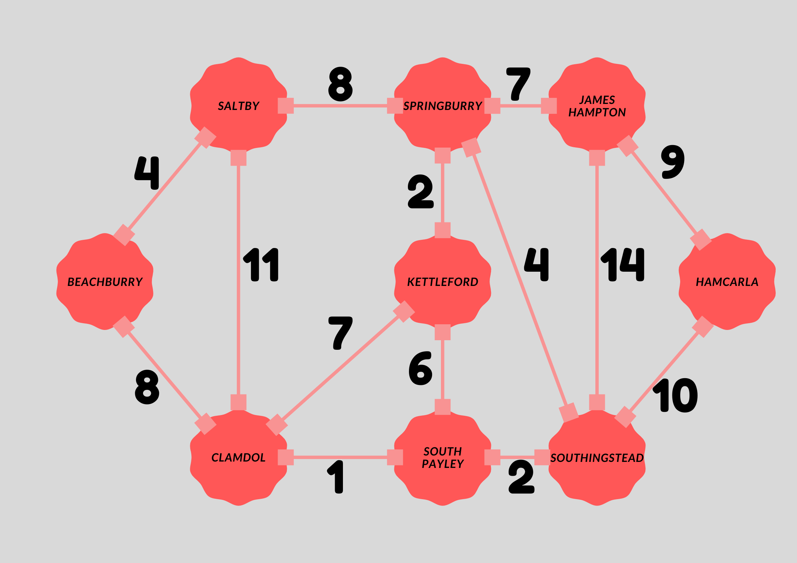

# YBS 414

## **Project Outline**
Deliver the cargos in cargobus, to cities by the roads in lowest cost.

## **Class Diagram**
### **Cargo**
    -order_number
    
    -to

getters()

setters()

### **CargoBus**
    -list of cargos

getter()

setter()

deliver_cargo()

show_cargos()

### **City**

    -name

getter()

setter()

### **Road**

    -from 

    -to

    -road_cost

getters()

setters()

### **Map**
    -map    

getter()

### **Shipment**
    -cargobus
    
    -map
    
setters()

calcutepath()

shipment()

start()

### **Main**

Object Constructors

shipment.start()

